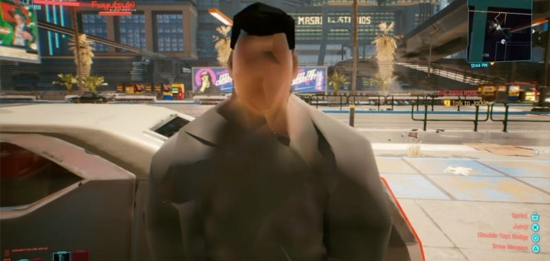
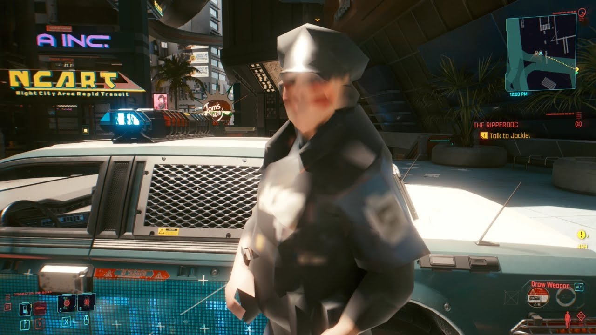

Biegać po pustych ulicach Night City podczas siedzenia na sedesie mamy doświadczyć już w pierwszym kwartale 2022!

## Atak hakerski

Jak wszyscy wiemy w lutym br. CD Projekt RED padło ofiarą **ataku hakerskiego**. W wyniku ataku wyciekły kody źródłowe największych produkcji studia jak i wewnętrza dokumentacja firmy. Parę dni po ataku hakerzy udostępnili kod źródłowy karcianki **Gwint**, a po paru następnych grupie hakerskiej podobno udało się spieniężyć resztę danych. Po tym sprawa ucichła, a jedynym skutkiem widocznym publicznie było opóźnienie patcha 1.2 do **Cyberpunk 2077**.

## Nowe informacje

Z zaufanego, acz anonimowego, źródła dowiedzieliśmy się, że przynajmniej część korespondencji wewnętrznej CD RED rzeczywiście została wykradziona i spieniężona na forach hakerskich. Znajdowały się w niej informacje o przygotowywanym przez Saber Interactive (twórcy portu Wiedźmina 3 na NS) **porcie CP2077 na najnowszego handhelda Nintendo!** 

Co więcej, mogliśmy przeczytać, że liczne błędy i glitche pojawiające się na konsolach poprzedniej generacji były **jednym, wielkim testem** tego do jakiego stopnia można posunąć się z downgrade-em, aby gracze dalej byli chętni zanurzyć się w mroku Night City i większość z nich ma być poprawiona do pół roku po premierze.